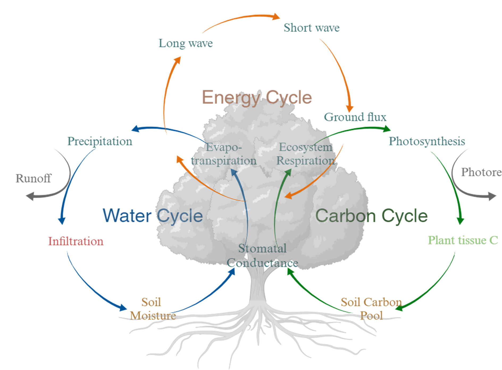

# fluxRecovery (IN DEVELOPMENT)

## Background
Field observations (for example Eddy covariance towers, ground observations, soil moisture sensors) is fundamental for ecosystem research. These datasets can be broadly categorized into three categories: (1) energy, (2) water, and (3) carbon variables. Typically, these raw datasets are recorded at 30-minute or 1-hour intervals, and may often contain gaps or record anomalous values, necessitating usage of post-processing tools. Due to group-specific developments, the tools for processing these variables often operate separately. This disparity creates bottlenecks, requiring manual adjustments to translate outputs from one package to another. Therefore, there is a need for a unified package that harmonizes the post-processing steps of raw datasets pertaining to water, carbon and energy variables. 

## Vision & Current Work
fluxRecovery is envisioned to make post-processing (1) user friendly, and (2) couple post-processing steps based on energy-water-carbon interactions.

Note: This package is in development stages currently. It builds on top of the `flux-data-qaqc` package (used to post process energy variables) by removing the input text configuration file dependency, and `Reddyproc` package (used to post process carbon variables). In addition, the package uses remote sensing datasets for post-processing soil moisture (from SMAP) and ground water (from GRACE) observations.



## How to Use?
1. Clone repo 
2. In the working directory you cloned the repository in, you can run the post processing workflows in a manner (similar to how you would `flux-data-qaqc`) as shown below:


```python
from fluxease import FluxData, VeriFlux
import pandas as pd

data = pd.read_csv(filename)     # read in data

# variable map to map internal names to names as found in the data passed
variable_map = [
    ("date", "Timestamp"),
    ("Rn", "NETRAD"),
    ("H", "H"),
    ("G", "G"),
    ("LE", "LE"),
    ("sw_in", "Rg"),
    ("sw_out", "SW_OUT"),
    ("lw_out", "LW_OUT"),
    ("lw_in","LW_IN"),
    ("vpd", "VPD"),
    ("t_avg", "Tair"),
    ("wd", "WD"),
    ("ws", "WS"),
    ("ppt", "Precip1_tot"),
    ('rh', "RH_1_1_1"),
    ("theta_1", "SWC_1_1_1"),
    ("theta_2", "SWC_2_1_1")
]

demo = FluxData(data, site_elevation, site_latitude, site_longitude, '30T', variable_map)
# 30T corresponds to the latency of the raw dataset (30 min)
# Other units that are supported are H (hours), D (days), W (weeks), M (months), Y (years)

demo_ver = VeriFlux(demo)

demo_ver.correct_data(meth = 'ebr')
print(demo_ver.corrected_daily_df['flux_corr'])     # printing a column in corrected daily frequency dataframe

```

## Contributors
- Karan Bhalla: Lead Developer (Coding, Execution)  (karanbhalla204 \<at\> tamu \<DOT\> edu)
- Debasish Mishra: Science Lead (Conception, Ideation) (debmishra \<at\> tamu \<DOT\> edu)

## Acknowledgement
This project is partially supported by Earth Science Information Partners (ESIP).
